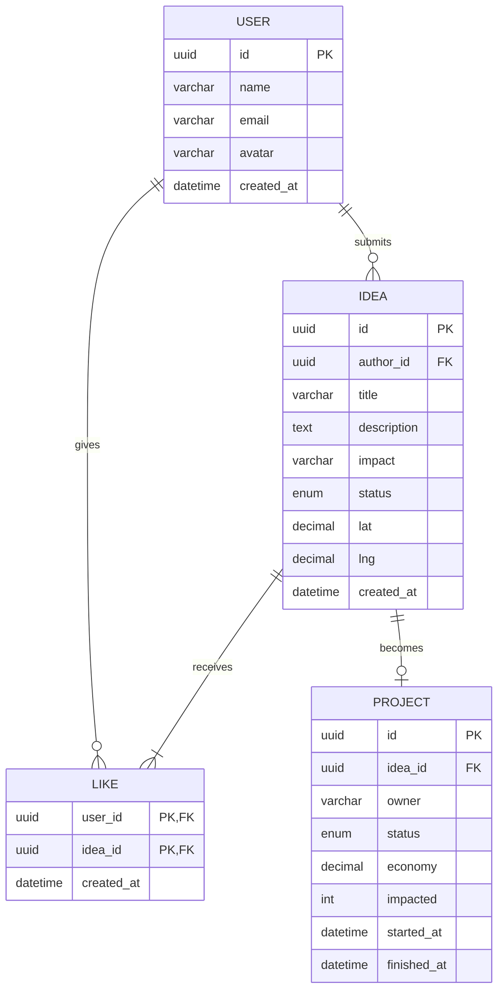

# DOCUMENTAÇÃO TÉCNICA – PROJETO KORAONE (ENTERPRISE CHALLENGE FIAP / EUROFARMA)

## 1. Visão Geral do Sistema
O **KoraOne** é uma plataforma web projetada para centralizar o ciclo de **ideação, curadoria e execução de projetos** de inovação dentro de uma empresa. A solução foi estruturada com uma arquitetura **modular e escalável**, permitindo operação em **modo demo (frontend + mocks)** e expansão futura para um **backend real**.

### Objetivos da Arquitetura
- Permitir **testes rápidos** e validação de usabilidade com APIs simuladas (MSW).
- Facilitar a **migração incremental** para um ambiente de produção (backend real em Spring Boot + MySQL).
- Garantir **separação de responsabilidades** entre frontend, backend e persistência de dados.
- Habilitar integrações com **IA generativa, autenticação corporativa (SSO)** e **analytics (Power BI)**.

---

## 2. Arquitetura do Sistema
A arquitetura do KoraOne segue o padrão **SPA (Single Page Application)**, conectando o cliente web (React) a um servidor de API REST (Spring Boot) e um banco relacional (MySQL).

```mermaid
flowchart LR
  U[Usuário (Colaborador)] --> FE[Frontend React + TypeScript]
  FE --> MSW[Mock Service Worker (Modo Demo)]
  FE --> API[Backend Spring Boot (Modo Produção)]
  API --> DB[(MySQL 8)]
  API --> AI[Aurora – Serviço de IA]
  FE --> OSM[(OpenStreetMap)]
  API --> BI[Power BI – Dashboards]
```

### Componentes Principais
| Camada | Tecnologia | Função |
|--------|-------------|--------|
| **Frontend** | React 18 + TypeScript | Interface do usuário (SPA). |
| **API Gateway** | Spring Boot 3 | Exposição de endpoints RESTful. |
| **Banco de Dados** | MySQL 8 (Community) | Persistência de ideias, projetos, usuários e likes. |
| **Mocks/API Fictícia** | Mock Service Worker (MSW) | Simulação de respostas HTTP para desenvolvimento. |
| **Serviço de IA** | Supabase Edge + OpenAI API | Geração de respostas e insights (Aurora). |
| **Mapas** | React Leaflet + OpenStreetMap | Exibição geográfica das ideias. |
| **Analytics (futuro)** | Microsoft Power BI Pro | Dashboards de engajamento e métricas. |

---

## 3. Estrutura de Diretórios (Frontend)
```bash
src/
├── components/          # Componentes reutilizáveis (UI e funcionais)
├── pages/               # Páginas principais (Feed, Map, MyTrail, Projects, Aurora)
├── stores/              # Zustand stores (estado global de ideias, projetos, usuário)
├── mocks/               # Handlers do MSW (endpoints simulados)
├── lib/                 # Funções auxiliares e integração com APIs
├── types/               # Tipos TypeScript (User, Idea, Project, etc.)
└── assets/              # Imagens, ícones e ilustrações
```

**Principais arquivos:**
- `src/lib/api.ts`: adaptador central de chamadas HTTP (fetch) para MSW/Backend real.
- `src/mocks/handlers.ts`: simulação de endpoints REST (ex: /ideas, /projects, /aurora/chat).
- `src/stores/ideaStore.ts`: gerenciamento de estado de ideias e curtidas.

---

## 4. Modelo de Dados (DER)


### Descrição das Entidades
- **User:** representa o colaborador autenticado (nome, e-mail corporativo, avatar).
- **Idea:** ideia submetida pelo colaborador, com título, descrição, impacto e status.
- **Project:** projeto gerado a partir de uma ideia aprovada, com KPIs de resultado.
- **Like:** relação entre usuário e ideia, para contabilizar curtidas e engajamento.

---

## 5. Contratos de API (Endpoints Planejados)
### Autenticação
| Método | Endpoint | Descrição |
|--------|-----------|------------|
| POST | `/auth/login` | Autentica usuário e retorna token JWT. |
| POST | `/auth/register` | Cadastra novo colaborador. |
| GET | `/me` | Retorna perfil e estatísticas pessoais. |

### Ideias
| Método | Endpoint | Descrição |
|--------|-----------|------------|
| GET | `/ideas` | Lista todas as ideias (com filtros por status/autor). |
| POST | `/ideas` | Cadastra nova ideia. |
| POST | `/ideas/{id}/like` | Registra ou remove uma curtida. |
| GET | `/ideas/map` | Retorna ideias com coordenadas (para exibir no mapa). |

### Projetos
| Método | Endpoint | Descrição |
|--------|-----------|------------|
| GET | `/projects` | Lista projetos e seus status. |
| POST | `/projects` | Cria novo projeto (vinculado a uma ideia). |
| GET | `/projects/{id}` | Retorna detalhes do projeto. |

### Aurora (IA)
| Método | Endpoint | Descrição |
|--------|-----------|------------|
| GET | `/aurora/insights` | Retorna cards de recomendações. |
| POST | `/aurora/chat` | Recebe mensagem e devolve resposta da IA. |

---

## 6. Manual de Instalação e Execução
### Pré-Requisitos
- Node.js 20+  
- npm/pnpm  
- Docker (para backend real)  

### Frontend (Modo Demo)
```bash
# Clonar repositório
git clone https://github.com/GuilhermeCostaProenca/koraone-hub.git
cd koraone-hub

# Configurar ambiente
echo "VITE_USE_MSW=true" > .env

# Instalar dependências
pnpm install

# Rodar aplicação
devpnm dev  # abre em http://localhost:5173
```

### Frontend (Com API Real)
```bash
echo "VITE_USE_MSW=false" > .env
echo "VITE_API_URL=http://localhost:8080/api" >> .env
pnpm dev
```

### Backend (Planejado)
```bash
# docker-compose.yml
version: '3.8'
services:
  api:
    build: ./api
    ports:
      - "8080:8080"
  db:
    image: mysql:8
    environment:
      - MYSQL_ROOT_PASSWORD=root
      - MYSQL_DATABASE=koraone
    ports:
      - "3306:3306"
```

---

## 7. Segurança e LGPD
- **Autenticação:** JWT + integração futura com LDAP/SSO corporativo.
- **Autorização:** papéis (colaborador, curador, administrador).
- **LGPD:** consentimento de uso de dados, anonimização para relatórios e política de retenção.

---

## 8. Observabilidade e Monitoramento
- **Logs estruturados:** SLF4J + ELK Stack.  
- **Métricas:** Prometheus + Grafana.  
- **CI/CD:** GitHub Actions executando testes e lint em cada push.

---

## 9. Plano de Evolução (30/60/90 dias)
| Prazo | Entregas | Objetivo |
|--------|-----------|-----------|
| **30 dias** | Implementar API mínima (auth, ideias, likes, projetos). | Backend operacional. |
| **60 dias** | Integração com SSO, logs e dashboards internos. | Estabilidade e segurança. |
| **90 dias** | Aurora 2.0 (IA generativa), dashboards Power BI, piloto Eurofarma. | Escalabilidade e valor real. |

---

## 10. Mock vs Real (Resumo)
| Módulo | Estado Atual | Futuro |
|--------|---------------|---------|
| Login/Auth | Mock | SSO/LDAP + JWT |
| Ideias/Projetos | Mock | API Spring Boot + MySQL |
| Insights Aurora | Mock | IA generativa real (OpenAI API) |
| Mapa | Real (OSM) | Persistência + filtros por unidade |
| Dashboards | Simulado | Power BI corporativo |

---

## 11. Perfis e Uso
| Perfil | Função | Permissões |
|--------|---------|-------------|
| **Colaborador** | Submete ideias, interage com feed, usa Aurora. | Criar/curtir ideias. |
| **Curador** | Avalia e aprova ideias, gera projetos. | CRUD completo de ideias/projetos. |
| **Administrador** | Monitora estatísticas e métricas. | Acesso total (dados e relatórios). |

---

## 12. Conclusão Técnica
A documentação técnica do KoraOne demonstra uma **base sólida e escalável**, pronta para migração de um ambiente educacional/demo para **produção corporativa real**. Com uso inteligente de ferramentas open-source, arquitetura modular e foco em experiência do usuário, o projeto se posiciona como um **case de inovação aplicável** no ambiente empresarial.

